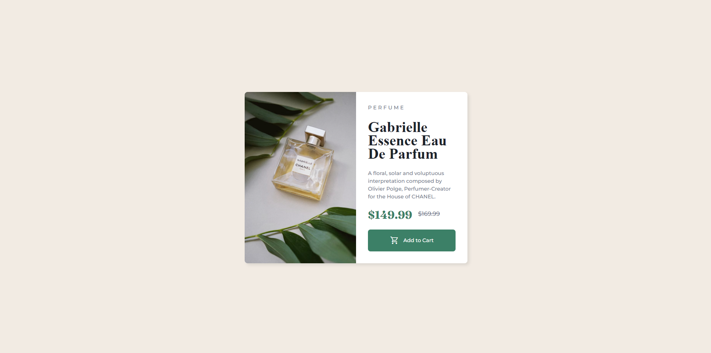

# Frontend Mentor - Product preview card component solution

This is a solution to the [Product preview card component challenge on Frontend Mentor](https://www.frontendmentor.io/challenges/product-preview-card-component-GO7UmttRfa). Frontend Mentor challenges help you improve your coding skills by building realistic projects. 

## Table of contents

- [Overview](#overview)
  - [The challenge](#the-challenge)
  - [Screenshot](#screenshot)
  - [Links](#links)
- [My process](#my-process)
  - [Built with](#built-with)
  - [What I learned](#what-i-learned)
  - [Continued development](#continued-development)
  - [Useful resources](#useful-resources)
- [Author](#author)
- [Acknowledgments](#acknowledgments)

## Overview

### The challenge

Users should be able to:

- View the optimal layout depending on their device's screen size
- See hover and focus states for interactive elements

### Screenshots

 - Desktop

### Links

- Solution URL: [Netlify Url](https://product-preview-challenge-sox.netlify.app/)
- [](https://app.netlify.com/sites/product-preview-challenge-sox/deploys)

## My process

Created the CSS first. Starting off by establishing the custom properties I would be using in the project. 
Then i pasted in And Bells CSS Reset, link below. Once the basic sode was laid out I then puilt the markup Grid layout 1st. 

I struggled placing the div in the center but after realising my error the was properly centered. 
Using photoshop I could measure the width of the div then divided that number by 16 to get the width in rem/em.

Most of the custom properties I use I learned watching Kevin Powells Youtube channel.


### Built with

- Semantic HTML5 markup
- CSS custom properties
- Flexbox
- CSS Grid
- Mobile-first workflow

### What I learned

I refreshed my knowledge and learned a bit more in Grid and Flex display. I learned how to align the icon and text next to each other using display: inline-flex.
```css
/* BUTTON */
.button {
    display: inline-flex;
    gap: 0.75rem;
    align-items: center;
    justify-content: center;
    font-family: var(--ff-body);
    width: 100%;
    cursor: pointer;
    border-radius: 0.5em;
    border: 0;
    text-decoration: none;
    padding: 1.25em 2em;
    font-size: var(--fs-400);
    line-height: 1;
    color: var(--clr-neutral-100);
    background-color: var(--clr-primary-400)
}
```

### Continued development

It was great getting to put this together as simply watching code tutorials and not practising what I had just learned is what has been holding my skill back for a long time now.

### Useful resources

- [And Bell CSS Reset](https://piccalil.li/blog/a-modern-css-reset/) - This is the code I used to reset the CSS of the page.

## Author

- Website - [Oscar Sebeloane](https://www.your-site.com)
- Frontend Mentor - [@OscarXS](https://www.frontendmentor.io/profile/OscarXS)
- Twitter - [@Oscar_XS1](https://www.twitter.com/oscar_xs1)

## Acknowledgments

Watching Kevin Powells Youtube channel is what helped me with this challenge
